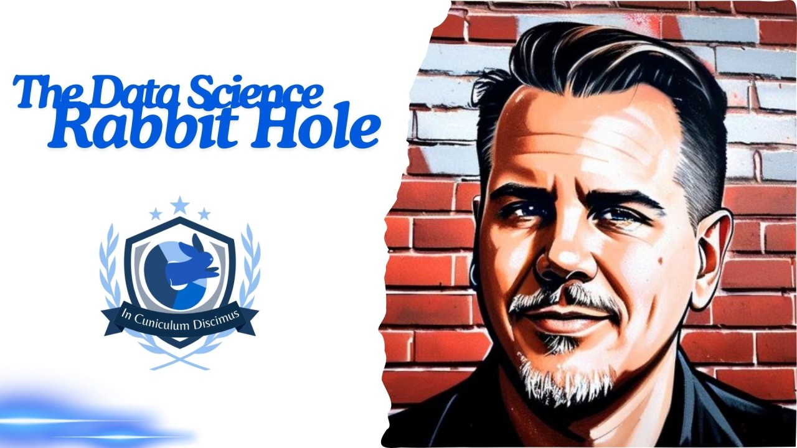
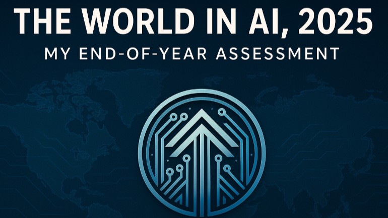

## CDIF variable cascade explained

# Measuring the World with AI

- [Report this article](/uas/login?session_redirect=https%3A%2F%2Fwww.linkedin.com%2Fpulse%2Fmeasuring-world-ai-slava-tykhonov-9fhae&trk=article-ssr-frontend-pulse_ellipsis-menu-semaphore-sign-in-redirect&guestReportContentType=PONCHO_ARTICLE&_f=guest-reporting)

[Slava Tykhonov](https://fr.linkedin.com/in/vyacheslavtikhonov)

### Slava Tykhonov

## Published Jun 27, 2026

[+ Follow](https://www.linkedin.com/signup/cold-join?session_redirect=%2Fpulse%2Fmeasuring-world-ai-slava-tykhonov-9fhae&trk=article-ssr-frontend-pulse_publisher-author-card)

The 
 [Climate-Adapt4EOSC](https://gr.linkedin.com/company/eosc-climate-adapt-4?trk=article-ssr-frontend-pulse_little-mention)
  project meeting in Manchester is finished, and I want to share what we discussed and why I believe it is important. Although our current use cases focus on climate change, once we prove that the approach works, we can extend and reuse this infrastructure for research in many other domains, and finally add variable measurement methodology in any data and AI application.

First, my own thoughts on the current state of artificial intelligence: it currently looks like a race between the major technology companies in the US and China. Everyone is trying to be the first to achieve Artificial General Intelligence (AGI), but in many ways they seem to have forgotten why they are pursuing it. It feels as though they are building a car (AI) that has only an accelerator pedal. There are no brakes, no steering wheel, and no clear destination. The entire effort is focused on making the "car" go faster and faster, without stopping to evaluate what has already been achieved or where it is actually heading. That is becoming a serious concern for society.

The dominant narrative also appears to focus on replacing humans. However, there is very little discussion about why humans should be replaced, who would ultimately benefit from that replacement, or what kind of society would exist if most human roles disappeared. These fundamental questions are rarely addressed.

Another important issue is measurement. Today, many claims are made about AI becoming more capable, but it is often unclear how these claims are being evaluated. There are no universally accepted baselines, no agreed variables, and often no clear definition of success. Without defining what should be measured, how it should be measured, and for whose benefit, it becomes difficult to judge whether progress is actually occurring. Much of this process is simply labeled "AI," even though the underlying evaluation framework remains vague.

We are currently living in the era of generative AI. Companies increasingly claim that their models are becoming smarter and more powerful. Yet they rarely provide convincing evidence explaining why these improvements create measurable value for society or how humanity as a whole benefits from them.

This naturally raises concerns about the future role of humans, particularly researchers. AI is already part of everyday life, and its adoption will continue to grow. However, many of the largest technology companies appear to pursue automation with the objective of minimizing or even eliminating human involvement. Our perspective is different.

Instead of removing humans from the process, we want to establish clear units of measurement and transparent evaluation frameworks, that's why European Commission decided to fund 
 [CDIF4EOSC](https://www.linkedin.com/company/cdif4eosc?trk=article-ssr-frontend-pulse_little-mention)
  project and it's received unbelievable 15/15 points during the evaluation. Every process should have well-defined baselines, measurable variables, and understandable quality indicators. Most importantly, humans should remain central in defining these measures rather than allowing AI systems to define and evaluate themselves.

One observation that emerged during the discussion is that publicly available data represents only a very small fraction of the world's information resources. It is probably less than one percent of all existing data. The remaining ninety-nine percent is stored in administrative databases, government institutions, companies, research organizations, and many other repositories. These datasets are often inaccessible, poorly harmonized, and disconnected from one another.

This hidden data represents one of AI's greatest opportunities. Rather than focusing exclusively on generating new content, AI could be used to retrieve, integrate, harmonize, and connect these distributed datasets while respecting ownership and governance. Something that is being neglected by the current AGI approach.

Our objective is therefore to make variables explicit, define transparent quality assessment processes, and provide measurable indicators back to data owners. At the same time, ownership and copyright must remain fully protected. It should always be clear who created a dataset, when it was created, who owns it, and under what conditions and license it can be used.

By embedding provenance, ownership, and copyright information directly into the infrastructure, we can encourage large technology companies to respect intellectual property instead of treating all publicly accessible information as freely exploitable. This is an important topic that is actively being discussed in the projects running in the European Union. Our solution, Cross-Domain Interoperability Framework (CDIF), should be integrated by all of them to bring AI-Ready data landscape back to our researchers, and it should work not only in Europe but worldwide. And we've started this alignment with research infrastructures from Australia, Africa and Latin America.

## Diving into CDIF Variable Cascade

[CODATA](https://fr.linkedin.com/company/codata-isc-committee-on-data?trk=article-ssr-frontend-pulse_little-mention)
  CDIF Framework defines a three-tiered "Variable Cascade" model, which is central to how it enables data integration. This structure allows researchers to move from abstract phenomena to concrete, machine-processable data points.

Here is the breakdown of the three levels of variables as described in [CDIF playbook](https://www.linkedin.com/redir/redirect?url=https%3A%2F%2Fcross-domain-interoperability-framework%2Egithub%2Eio%2Fcdifbook%2F&urlhash=Zib9&trk=article-ssr-frontend-pulse_little-text-block):

## Recommended by LinkedIn

[

## How do you generate value from AI, responsibly?…

## Sakib Moghal

1 year ago](https://www.linkedin.com/pulse/how-do-you-generate-value-from-ai-responsibly-thoughts-sakib-moghal-p6gle)

[

## 2026 AI Predictions: When the Science Fair Closes and…

## Michael Bagalman

7 months ago](https://www.linkedin.com/pulse/2026-ai-predictions-when-science-fair-closes-factory-turns-bagalman-lsrje)

[

## The World in AI, 2025 — My End-of-Year Global…

## Adem Ibrahim

7 months ago](https://www.linkedin.com/pulse/world-ai-2025-my-end-of-year-global-assessment-adem-ibrahim-ninne)

## 1. Conceptual Variable (The Abstract Phenomenon)

- Definition: This is the highest, most abstract level. It represents the phenomenon being studied without any technical constraints.
- Example: "Temperature."
- Role: It defines the "what" (the scientific concept) but lacks the parameters for measurement. It is effectively a dictionary definition or a general scientific idea.

## 2. Represented Variable (The Common Denominator / Integration Layer)

- Definition: This is the critical "middle layer" for data integration. It combines the Conceptual Variable with a specific Unit of Measure.
- Why it matters: It serves as a common denominator. If two different datasets measure temperature (the conceptual variable) in Celsius (the unit of measure), they can be linked and integrated through this level.
- Role: This level allows researchers to compare and combine data across different use cases or even within the same study. It acts as the bridge that allows for logical data integration.

## 3. Instance Variable (The Implementation)

- Definition: This is the concrete representation of the variable as it exists within a specific dataset.
- Role: It is tied to the actual data structure. It shows how the "Represented Variable" has been encoded or implemented in a specific data file or database.
- Function: It is the "real-world" manifestation - the actual column, field, or key-value pair that a machine reads when processing the dataset.

Data integration process relies on the synergy between these variable definitions and the Data Structure (the format, such as tabular or time series).

- The Integration Strategy: By documenting the "Variable Cascade" (how an abstract concept becomes a concrete instance) alongside the "Data Structure" (how that instance is formatted), the project enables the decomposition and recomposition of datasets.
- Practical Application: In projects like 
   [Climate-Adapt4EOSC](https://gr.linkedin.com/company/eosc-climate-adapt-4?trk=article-ssr-frontend-pulse_little-mention)
    this cascade allows automated systems to take disparate temperature measurements from various sources, normalize them through their represented variables, and reconstruct them into a single, integrated data product.

CDIF framework intends to make this "Variable Cascade" and its relationship to "Data Structure" a core discussion topic for upcoming workshops, as they view this mapping as the most powerful tool for solving cross-domain interoperability challenges.

We can use the process to measure something at vastly different levels of granularity, ranging from microscopic (e.g., millisecond-level variable states) to organizational/business-wide (e.g., decade-long data lifecycles). Of course, there is risk: If two systems implement CDIF at different levels of granularity, they become fundamentally incompatible. Their concepts do not align because they are operating in different "conceptual worlds" and CDIF needs a more formalized "Business Process Layer", and this should act as a bridge, instructing implementers on the identifying and tracking Variable States.

Because the value of a variable changes as it moves through a processing chain, simple identification is insufficient., there is also a specific technical point of friction is the challenge of assigning identifiers to variables within a process. We're looking at advanced languages like STTL (Structured Data Transformation Language) to handle these complex transformations. They acknowledge that while this is technically deep, they must balance "how detailed we can get" with "what is actually necessary for interoperability."

Another problem is the process of harmonization via provenance and semantics. This is how we can handle cases where datasets cannot be linked because of minor differences (e.g., unit of measure mismatches):

- SKOS for Mapping: Using SKOS (Simple Knowledge Organization System) to provide a mapping layer and indicate hierarchical relationships.
- Actionable Policy via ODRL: The team proposed using ODRL (Open Digital Rights Language) not just for access control, but as a mechanism for "actionable policy." For example, ODRL could instruct an LLM to automatically retrieve specific provenance data or flag a human researcher when an integration error occurs.
- Semantic Instructions: The team envisions a future where instructions for LLMs (to explain data or perform integrations) are baked into the provenance and semantic layer, effectively making the data "self-explaining" for intelligent agents.

Looking ahead, once we begin building this type of trustworthy infrastructure, we should be able to integrate vastly larger amounts of data than are currently available. This would unlock new scientific discoveries, improve AI applications, and enable significantly greater societal benefits while maintaining transparency, trust, and respect for data ownership. And I already gave you full overview of Trust last week.

Coming back to Paris with the feeling that we're close to accomplish something serious, and ready to move forward.

---

[Originally published on LinkedIn](https://www.linkedin.com/pulse/measuring-world-ai-slava-tykhonov-9fhae).
