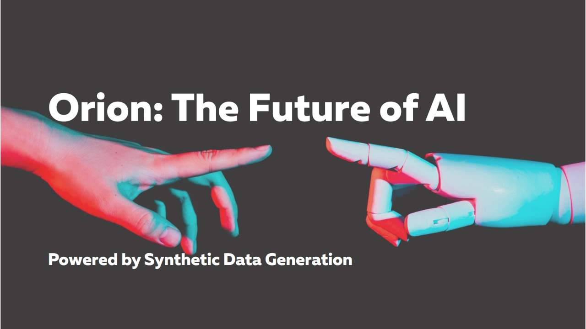
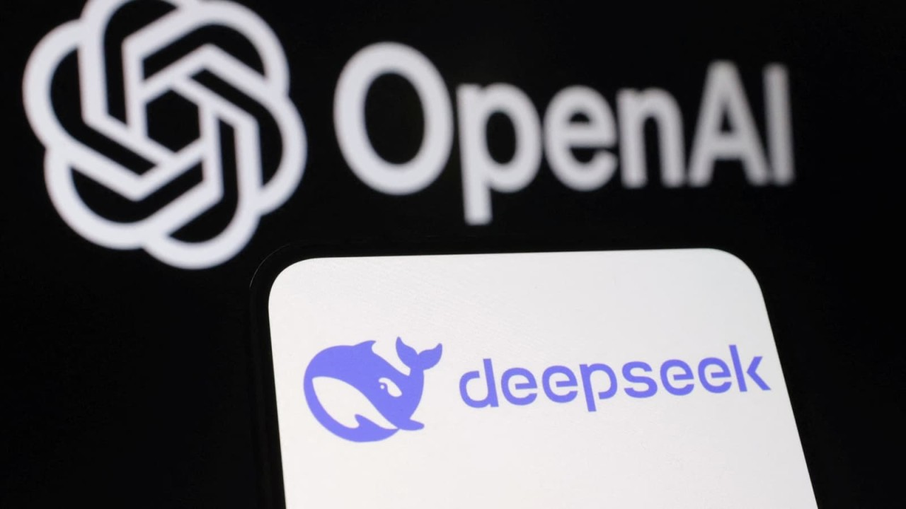
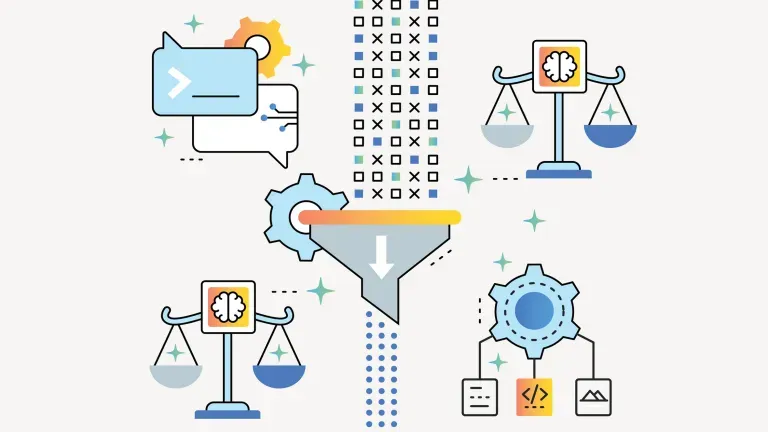

Slava Tykhonov, Yann LeCun and Roberto di Cosmo during the Project Tapestry meeting

# Project Tapestry, Sovereign AI, and Yann LeCun's Vision

- [Report this article](/uas/login?session_redirect=https%3A%2F%2Fwww.linkedin.com%2Fpulse%2Fproject-tapestry-sovereign-ai-yann-lecuns-vision-slava-tykhonov-n1hqe&trk=article-ssr-frontend-pulse_ellipsis-menu-semaphore-sign-in-redirect&guestReportContentType=PONCHO_ARTICLE&_f=guest-reporting)

[Slava Tykhonov](https://fr.linkedin.com/in/vyacheslavtikhonov)

### Slava Tykhonov

## Published May 22, 2026

[+ Follow](https://www.linkedin.com/signup/cold-join?session_redirect=%2Fpulse%2Fproject-tapestry-sovereign-ai-yann-lecuns-vision-slava-tykhonov-n1hqe&trk=article-ssr-frontend-pulse_publisher-author-card)

It has been two weeks since I participated in a Project Tapestry meeting in Paris shared by 
[Yann LeCun](https://www.linkedin.com/in/yann-lecun?trk=article-ssr-frontend-pulse_little-mention)
  , and it was very interesting. We discussed AI and data sovereignty, with presentations from different partners across multiple continents. People presented what they had already achieved in the traditional Large Language Model space.

I would say that the audience was not fully convinced by the quality of current AI development because it is still non-deterministic and biased. What was discussed - and what Yann really wants - is something different. According to Yann, we need to share vectors and model weights more freely while ensuring that data remains under the ownership of all participating parties.

Essentially, we can think about a process supported by digital policies, for example using ODRL, where every dataset is converted into vector space and distributed across different models. There are already approaches being developed for models such as Gemma, Llama, Mistral, and DeepSeek. Data should not move and remain in the hands of their owners. I think this is feasible, and it is something we can already do today.

Even more importantly, large models are probably not the optimal form of AI, and this is becoming increasingly clear because they are static by nature. We need to think about a new organization of datasets and training systems that also takes data ownership into account. Everything should be governed properly, and data governance is becoming the key issue. Yann even said that we probably need to consider something entirely new, possibly even without tokenizers. Some time ago I've even described our own experiments in making LLM models fully deterministic, and they're very promising.

A large part of the discussion was also about bias. Every country naturally wants to reduce bias according to its own cultural and legal context, but at the same time we also need a common baseline capable of detecting bias consistently. Ideally, as soon as someone releases a new model, we should be able to apply this baseline automatically. If the model passes the evaluation, it could then be certified and recommended for use. 
 [AMI LABS](https://www.linkedin.com/company/amilabs-labs?trk=article-ssr-frontend-pulse_little-mention)
  even conducted evaluations of current LLMs using social science surveys.

I would say that decentralization of knowledge really resonates with me. My own attempt with the Dataverse Network is already well known, and we have managed to accomplish an important step by building the platform both at the European and global level, currently expanding into Africa and Latin America.

Decentralization of knowledge for machine learning is an essential step toward real AI sovereignty. This could provide governments in different countries with foundational models that they can adapt into custom models for specific domains. At the same time, it could open the door for commercial companies. Since companies would not need to share raw data — only weights or vectorized knowledge — they could train and operate their own models in private cloud environments while still validating them against their own organizational baselines to ensure that the models behave correctly and that their knowledge remains up to date.

For now, Gemma was selected as a candidate foundational model within Project Tapestry. However, a much better approach would be to standardize the ingestion interface and provide vector weights suitable for any model, and I believe we are quite close to achieving this.

In a way, this new distributed form of intelligence can be compared to a CD player ecosystem. The foundational model would correspond to the CD player itself, while the “CD discs” would contain packaged intelligence with provenance information and certificates identifying the responsible vendor. Just like 10 or 20 years ago, you could insert a disc into a player and access its content — or simply use your own digital wallet to connect to your models. When new information becomes available, a new “disc” could be created and distributed. From a marketing perspective, packaged knowledge with appropriate licensing could even be sold in supermarkets.

I can imagine a future where, when visiting a store — real or virtual — you could buy packaged intelligence in the form of model weights ready to be used on compatible foundational models. Knowledge will become a real commodity that can be traded and exchanged, forming the basis of a new digital economy that moves power away from large technology companies.

Still, there are many questions and challenges. If we think about this broader transition from static LLMs to a knowledge-driven economy, it moves artificial intelligence away from the current Markdown paradigm toward knowledge graphs, ontologies, and controlled vocabulary alignment. Once we move to knowledge graphs, we are no longer dealing only with static data from the past. Instead, we begin working with dynamic data structures representing the future of knowledge itself. 
[Yann LeCun](https://www.linkedin.com/in/yann-lecun?trk=article-ssr-frontend-pulse_little-mention)
  gave excellent interview to
[Alexy Khrabrov](https://www.linkedin.com/in/chiefscientist?trk=article-ssr-frontend-pulse_little-mention)
 , you can watch it yourself.

## Recommended by LinkedIn

[

## Orion: The Next AI Evolution Powered by Synthetic Data…

## Vishnu Rao

1 year ago](https://www.linkedin.com/pulse/orion-next-ai-evolution-powered-synthetic-data-generation-vishnu-rao-xd5ec)

[

## DeepSeek's $5M Splash: Triggering a $1.1 Trillion Tech…

## Shantanu Patil

1 year ago](https://www.linkedin.com/pulse/deepseeks-5m-splash-triggering-11-trillion-tech-tsunami-patil-vop7e)

[

## Not Every AI Problem Is a Data Problem

## ACM, Association for Computing Machinery

9 months ago](https://www.linkedin.com/pulse/every-ai-problem-data-association-for-computing-machiner-druye)

This opens the possibility for online machine learning, graph-based training methods, and decentralized knowledge distribution networks. You can think about human-curated intelligence where multilinguality and multimodality become essential by design, with all required resources and actions tracked in a distributed graph. This should work especially well for the commercial world as soon as data is extended semantically at the metadata layer.

That is something we envisioned during work on Croissant together with people from [Google](https://www.linkedin.com/redir/redirect?url=https%3A%2F%2Fwww%2Egoogle%2Ecom%2F%3Futm_source%3Dchatgpt%2Ecom&urlhash=AT9C&trk=article-ssr-frontend-pulse_little-text-block), [Hugging Face](https://www.linkedin.com/redir/redirect?url=https%3A%2F%2Fhuggingface%2Eco%2F%3Futm_source%3Dchatgpt%2Ecom&urlhash=5-Lo&trk=article-ssr-frontend-pulse_little-text-block), and others. Essentially, the whole knowledge graph could also be organized through Croissant, as it already acts as a navigation layer for knowledge integration. According to the Semantic Croissant vision, it could be combined with the Cross-Domain Interoperability Framework (CDF) and supported by decentralized identifiers (DIDs). Every DID contains a public key and a private key: the private key allows updates to records, while the public key confirms authorship. Together, they can form digital certificates attached to these “intelligence discs” and distributed securely.

All of this could be integrated into digital policies, and we see a huge role for ODRL here. Imagine using digital policies to make data actionable: policies could define where and how a model could be distributed and used, all rules and permissions required to access it, and even expiration dates. If certain rules were violated, the model might simply not function in some jurisdictions. For example, some European AI models could potentially be restricted in China, while some American models might not comply with European Union regulations such as GDPR because of specific forms of bias.

Now we should think carefully about the nature of LLMs themselves. From a conceptual point of view, are vectors software, data, or both? What is the role of the inference engine — referring again to the CD player analogy — and where should possible restrictions be implemented: at the model level or at the inference layer?

This is where Software Heritage should play a critical role, and I really enjoyed discussions with 
[Roberto Di Cosmo](https://fr.linkedin.com/in/roberto-di-cosmo?trk=article-ssr-frontend-pulse_little-mention)
  about the possible future of AI. The cost of software production is dropping almost to zero as people increasingly use AI models, but what we are facing now is only the beginning of something truly tremendous. As Roberto explained, with the AI Act coming into force and without appropriate licensing frameworks for software produced with the help of AI, we are moving into a rabbit hole at the speed of light. Something has to change, and the approach in which model vectors are distributed and digitally signed seems to be the right way forward.

My gut feeling is that, instead of asking AI agents to directly build software, we will move toward specification-driven development combined with evaluation and baselines. That is essentially the future of software engineering. As soon as you have a clear specification, you should be able to ask any model to build software for you from scratch - and, even more importantly, maintain it properly.

This vision is strongly aligned with the direction Yann LeCun developed during his time at [Meta](https://www.linkedin.com/redir/redirect?url=https%3A%2F%2Fabout%2Emeta%2Ecom%2F%3Futm_source%3Dchatgpt%2Ecom&urlhash=KejT&trk=article-ssr-frontend-pulse_little-text-block). Now, with his new company launched earlier this year, and through Project Tapestry initiated by the 
 [The AI Alliance](https://www.linkedin.com/company/the-ai-alliance?trk=article-ssr-frontend-pulse_little-mention)
  and coordinated by [IBM](https://www.linkedin.com/redir/redirect?url=https%3A%2F%2Fwww%2Eibm%2Ecom%2F%3Futm_source%3Dchatgpt%2Ecom&urlhash=4BGU&trk=article-ssr-frontend-pulse_little-text-block), where Yann acts as scientific advisor, the goal is to build a new sovereign AI model and a decentralized infrastructure for artificial intelligence. I was very surprised how close our own vision related to data spaces in Europe aligns with Japan, when 
[Mitch Tsuda](https://jp.linkedin.com/in/mitch-tsuda-89a010228?trk=article-ssr-frontend-pulse_little-mention)
  presented their latest developments.

And we fully support this vision, and 
 [CODATA](https://fr.linkedin.com/company/codata-isc-committee-on-data?trk=article-ssr-frontend-pulse_little-mention)
  is going to lead and co-coordinate several Horizon 2020 projects and develop an AI-ready landscape based on Semantic Croissant, while aligning developments with Project Tapestry. We also want to take a slightly different approach to building the platform by relying on the establishment of a strong core — similar to Linux — and enabling the integration of any tools and services on top of it. So we invite everyone interested to approach 
 [The AI Alliance](https://www.linkedin.com/company/the-ai-alliance?trk=article-ssr-frontend-pulse_little-mention)
  and join the journey.

I will be off next week to participate in the 
 [United Nations](https://www.linkedin.com/company/united-nations?trk=article-ssr-frontend-pulse_little-mention)
  Workshop on Supporting Standards in Wiesbaden, so hopefully I will see some of you there.

---

[Originally published on LinkedIn](https://www.linkedin.com/pulse/project-tapestry-sovereign-ai-yann-lecuns-vision-slava-tykhonov-n1hqe).
