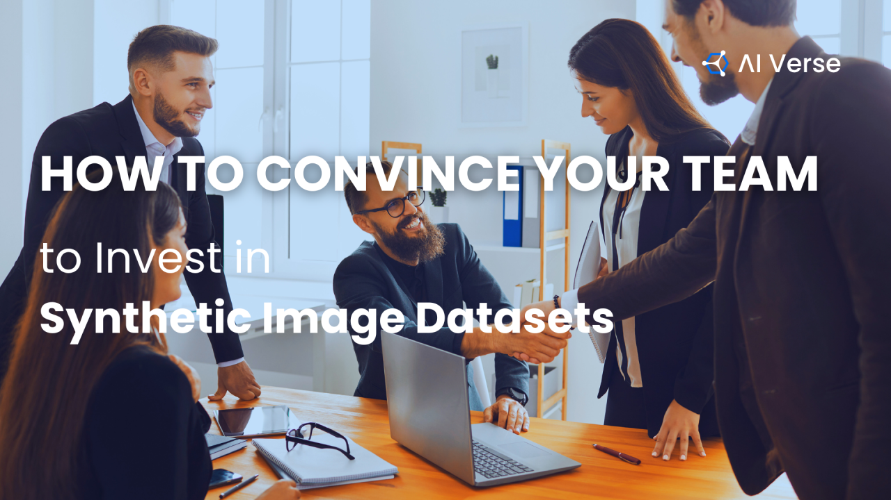

## Celebrating King's Day in Amsterdam, April 2026

# Who Actually Did the Work? Why your AI Needs a Digital Identity?

- [Report this article](/uas/login?session_redirect=https%3A%2F%2Fwww.linkedin.com%2Fpulse%2Fwho-actually-did-work-why-your-ai-needs-digital-slava-tykhonov-de4re&trk=article-ssr-frontend-pulse_ellipsis-menu-semaphore-sign-in-redirect&guestReportContentType=PONCHO_ARTICLE&_f=guest-reporting)

[Slava Tykhonov](https://fr.linkedin.com/in/vyacheslavtikhonov)

### Slava Tykhonov

## Published May 1, 2026

[+ Follow](https://www.linkedin.com/signup/cold-join?session_redirect=%2Fpulse%2Fwho-actually-did-work-why-your-ai-needs-digital-slava-tykhonov-de4re&trk=article-ssr-frontend-pulse_publisher-author-card)

,This week I'm in the Netherlands, celebrated the King's Day and participated in several insightful meetings regarding Agentic AI. The topic of ownership has become a dominant theme in our discussions, particularly within the 
 [Research Data Alliance (RDA)](https://www.linkedin.com/company/research-data-alliance?trk=article-ssr-frontend-pulse_little-mention)
  Data Director working group (a collaboration with 
 [Microsoft](https://www.linkedin.com/company/microsoft?trk=article-ssr-frontend-pulse_little-mention)
  ) and the 
 [Google](https://www.linkedin.com/company/google?trk=article-ssr-frontend-pulse_little-mention)
  led Croissant community. I think challenge critical and must be addressed before we can effectively integrate AI as own research collaborator.

A few years ago, the answer to a simple research question - “Who created this dataset?” - was straightforward. A person or a team, human "for sure", with a paper, maybe a repository link, and a DOI.

Today, that answer is getting… complicated.

We are rapidly entering an era where AI agents are no longer just passive tools but active research collaborators. They scrape data, generate metadata, transform datasets, and make critical decisions across the research lifecycle.

In some sophisticated workflows, dozens of these autonomous agents might contribute to a single output. And yet our current infrastructure still assumes a human did everything.

Just imagine, you're asking your AI agent to collect or integrate some dataset, it's doing job and scraping Internet, bringing all stuff together and publishing it under your name - with data originally belonging to someone else. The same question as with self-driving cars - who will take the responsibility if something wrong has happened with your AI?

### The Visibility Gap We’re Ignoring

Most current research systems were designed for a human-centric world where identifiers like Digital Object Identifiers (DOIs) are primarily used to point to final, human-created artifacts . However, these traditional systems cannot tell the full story of how a resource was produced because they often fail to capture the chain of transformations, the intermediate steps, the specific AI agents involved, or the various decisions made throughout the automated workflow.

In an environment increasingly driven by AI agents, this missing context creates a dangerous blind spot that causes the entire history of the data to vanish, leaving researchers unable to verify actions or trace the origin of hallucinations. To resolve this, we have to advocate for a provenance chain where every resource and action is digitally signed both by agents and humans.

Such a system would likely utilize Decentralized Identifiers (DIDs) and verifiable credentials documented in a machine-readable JSON-LD format. This infrastructure should be ready to manage the billions of micro-actions that current centralized infrastructure cannot handle. But only linking these agentic actions into a shared graph, we can ensure that the "story" of the data remains traceable and testable as it moves toward official publication.

Still not convinced? We're already running around 50 agents in parallel to create and improve datasets in realtime, and it looks quite scary.

### The Scale Problem No One Designed For

Now imagine what’s actually happening behind the scenes, when your agents are in action.

As you can imagine, they are constantly:

- Collecting and scraping data
- Cleaning and enriching it
- Generating metadata
- Combining sources
- Making decisions autonomously

At scale, this means millions or even billions of micro-actions.

Traditional centralized systems were designed for human-led publication - and never built for this. They struggle not just technically, but conceptually, even to understand who did what. Is it human or his agent did that?

And what are leading AI labs actually doing? It seems they’re trying to map a dynamic, high-frequency process onto a static, low-frequency LLM model, while connecting tools and services through MCP - isn’t that the case? Meanwhile, Jensen Huang is telling us that $500K engineers should be using at least $250K worth of tokens, and that you’re not serious if you’re not burning more credits than necessary.

Dear Jensen, reality already feels synthetic - especially when you’re scrolling LinkedIn and hoping to find content that hasn’t been generated by AI replicants. At least in Blade Runner they had the Voight-Kampff test. We don’t even need that anymore. it’s often obvious who is using AI for writing, and how.

[Kurt Cagle](https://www.linkedin.com/in/kurtcagle?trk=article-ssr-frontend-pulse_little-mention)
  even ran an experiment co-writing with an AI assistant named Chloe, but you can immediately tell it’s not human.

Anyway, to the 
 [OpenClaw](https://www.linkedin.com/company/openclawai?trk=article-ssr-frontend-pulse_little-mention)
  folks - special “thanks” for automatically retranslating internet content without even reading it. Sometimes it really does feel like being surrounded by human replicants.

## Inside of the Blade Runner Universe

## Recommended by LinkedIn

[

## How to Convince Your Team to Invest in Synthetic Image…

## AI Verse

1 year ago](https://www.linkedin.com/pulse/how-convince-your-team-invest-synthetic-image-datasets-ai-verse-jejwe)

[

AI is the future. But do we have the right data?

## Alok Agrawal

1 year ago](https://www.linkedin.com/pulse/ai-future-do-we-have-right-data-alok-agrawal-whmhc)

[

## Sherpa's Log - AI Personalization and the Data…

## Astrid Yee-Sobraquès, FRM, CISSP

7 months ago](https://www.linkedin.com/pulse/sherpas-log-ai-personalization-data-retention-astrid-hio4e)

### A Shift Toward Machine Identity

This is where the conversation is evolving. Instead of focusing only on identifying outputs, we need to begin identifying the actors involved (AI agents), the actions they performed, and the context in which those actions took place how and when they happened.

This is precisely the role of decentralized identifiers (DIDs) and verifiable credentials. In simple terms, a DOI tells you what something is, while a DID helps you understand who did what, when, and how. By giving every AI agent a unique, signed identity, we move away from a black-box model of automation toward something far more powerful: a transparent, verifiable graph of actions.

This shift isn’t just technical - it’s foundational.

AI systems always hallucinate. They make "invisible" mistakes - and those mistakes can quietly propagate across complex pipelines. Without a clear provenance trail, you lose the ability to trace errors, verify results, or assign responsibility. The situation becomes even more challenging because AI systems are designed to be non-deterministic: the same process can produce different outputs each time.

So when something goes wrong, it’s not just a matter of fixing a single issue - the real question is where to begin.

### Making the Invisible Visible

Now imagine a different model where every action is digitally signed, every step is recorded in a machine-readable format such as JSON-LD, every agent has a verifiable identity, and every transformation is traceable.

Suddenly, errors can be traced back to specific agents or components, decisions can be audited, workflows become testable, and accountability becomes enforceable.

This turns AI from a black box into something we can actually reason about.

### The Future Isn’t DOI or DID - It’s Both, with actionable policy

Here’s the key insight: we don’t need to replace existing systems. We just need to extend them with digital policy and describe all actions. ODRL (Open Digital Rights Language) is a good candidate, we're working on such prototype, but there are a lot of other options, for example, smart contracts.

A likely future can look like this: you're creating AI agent and giving them authority to use decentralized identifiers to sign and track their internal work, while checking and publishing final outputs using DOIs. Both DIDs and DOIs are connected within a shared provenance graph, and fully traceable.

Instead of a static endpoint, you get a living history of creation. We can move from a world of static documents to one of dynamic, verifiable process - and that changes everything.

In this new world, identity is no longer just about naming things. It becomes a way to understand actions, trace decisions, track provenance and maintain trust at scale.

And this future is definitely not AGI since you can run your agents on your personal computer. So no huge resources and energy to power data centers in the primitive hope to get something smarter then average human, just building collaboration between humans and AI in the benefit of community.

### The Final Question

As AI becomes deeply embedded in research, we need to ask:

- What does authorship mean when agents are involved?
- Who is responsible for AI-generated outputs? Who will take ownership?
- How do we maintain trust in systems we don’t fully control?

We’re not just upgrading infrastructure, we can redefine how knowledge itself is created, verified, and trusted.

Are we ready for a world where every data point has a traceable history - and every agent leaves its own digital signature?

I'm happy to discuss this further during upcoming AI Agentic Summit at [GOSIM Paris](https://www.linkedin.com/redir/redirect?url=https%3A%2F%2Fparis2026%2Egosim%2Eorg%2Fspeakers%2Fslava-tykhonov%2F&urlhash=MCCI&trk=article-ssr-frontend-pulse_little-text-block), or catch me during [Dataverse Community Meeting](https://www.linkedin.com/redir/redirect?url=https%3A%2F%2Fdcm2026%2Ecom%2Fwp-content%2Fuploads%2F2026%2F04%2FPRELIMINARY-PROGRAMME-2026-04-02%2Epdf&urlhash=PmOm&trk=article-ssr-frontend-pulse_little-text-block) in Barcelona, or lately at the Worldbank conference in Paris, or even 
 [United Nations](https://www.linkedin.com/company/united-nations?trk=article-ssr-frontend-pulse_little-mention)
  events in Wiesbaden, Germany.

---

[Originally published on LinkedIn](https://www.linkedin.com/pulse/who-actually-did-work-why-your-ai-needs-digital-slava-tykhonov-de4re).
